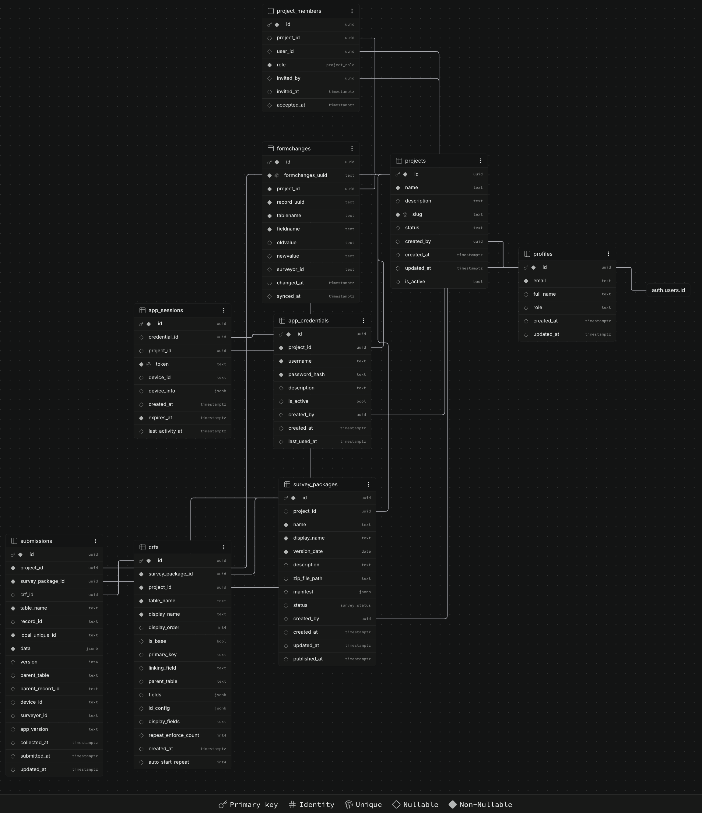

# DataKollecta Web — Design Overview

This is the current, maintained description of how this system is built and why —
consolidated from several design-stage documents that had drifted out of sync with
what was actually implemented. For anything schema-specific (exact columns, RLS
policies, foreign keys), the source of truth is
[`supabase/migrations/20260817102141_remote_schema.sql`](supabase/migrations/20260817102141_remote_schema.sql),
pulled directly from the live database — it isn't duplicated here, since a second
copy is exactly what went stale last time.

## System Overview

DataKollecta is a data collection and management platform for research projects,
field surveys, and clinical trials. It has two halves:

1. **This web portal** — where administrators design surveys, manage project teams,
   and view/export collected data.
2. **A mobile/desktop field client** (the separate `DataKollecta` app repo, and its
   sibling product `GiSTX`, both built from the same codebase) — where field workers
   download surveys, collect data offline, and sync it back here.

The system is offline-first by design: data is assumed to be collected without a
connection and may arrive in batches, sometimes days later.

## Terminology

| Concept | Term used in this codebase | Notes |
|---|---|---|
| A survey ZIP package | **Survey** (`survey_packages`) | The overall study design, versioned |
| An individual XML form within a survey | **Form** / **CRF** (`crfs`) | "CRF" (Case Report Form) shows up in field-research contexts; "Form" is the generic UI term |
| Uploaded data records | **Submissions** (`submissions`) | One row per completed form instance |
| Web portal users | **Project Members** (`project_members`) | People who log into this site |
| Mobile app users | **Field Team** (`app_credentials`) | Shared/team login codes typed into the phone app, not personal accounts |

## User Roles

### Web portal users (`project_members.role`)

The real enum is `viewer`, `editor`, `admin`, `owner` — based on what the live RLS
policies actually grant (not on any earlier aspirational role list):

- **Owner** — full control: create/rename/delete the project, manage project
  members, everything an admin or editor can do.
- **Admin** — can manage field-team credentials (`app_credentials`) in addition to
  everything an editor can do. Cannot manage project members or project settings —
  those remain owner-only in the current RLS.
- **Editor** — can create, edit, and publish surveys (`survey_packages`, `crfs`),
  and manage submissions.
- **Viewer** — read-only access to surveys, forms, and submissions.

### Field workers (mobile app)

Field workers never log into this website. They authenticate against the mobile
app using a **Project Code + Username + Password** — simple, often-shared
credentials (e.g. "Team A", "Nurse 1") issued and revoked by an owner or admin from
the project's Field Team screen, entirely separate from `profiles`/web accounts.

## Core Functional Modules

- **Authentication & multi-tenancy** — web users authenticate via Supabase Auth
  (email/password); every table is scoped by `project_id` and gated by RLS so a
  member of one project cannot see another's data.
- **Project workspace** — each project is the hub for its own surveys, data, field
  team, and members.
- **Survey configuration engine** — surveys are authored as Excel data dictionaries,
  converted to XML + a `survey_manifest.gistx` package by the separate
  `DataKollecta-SurveyGen` tool (or edited directly in this site's survey designer),
  then uploaded here as a versioned `survey_packages` row plus one `crfs` row per
  form.
- **Field team management** — create/revoke `app_credentials` per project.
- **Data aggregation** — the mobile app posts submissions and form-edit audit
  entries to the `app-sync` edge function, upserted by `local_unique_id` so a
  re-sent or duplicate upload doesn't create a second row.
- **Data visualization & export** — browse submissions per form, view a single
  record's full detail (including its edit history), export to CSV or a ZIP of
  CSVs.

## Data Model

Real tables, in the order data actually flows through them:

- **`profiles`** — website users (id, email, full_name). Created automatically on
  signup via a `handle_new_user` trigger.
- **`projects`** — the top-level container. Everything else belongs to one.
- **`project_members`** — the access list linking a `profile` to a `project` with a
  role. If you're not in this table for a project, you can't see it — this is what
  RLS checks everywhere else.
- **`survey_packages`** — one row per uploaded/published survey version (the ZIP).
- **`crfs`** — one row per form within a survey package, describing its fields,
  ID-generation config, and parent/child linking.
- **`app_credentials`** — field-team login codes (distinct from `profiles`).
- **`app_sessions`** — created when a phone logs in; tracks the bearer token and
  device info for that session.
- **`submissions`** — the actual collected data, one row per completed form
  instance, stored as JSONB in `data`. `local_unique_id` is the mobile app's own
  generated ID, used for upsert-based deduplication.
- **`formchanges`** — the audit trail for edits made *after* a submission first
  synced (either a field correction made on the phone and re-synced, or an edit
  made directly on the website): old value, new value, who changed it, when.

### General flow

1. Sign up → a row appears in `profiles`.
2. Create a project → rows appear in `projects` and `project_members` (you, as
   owner).
3. Upload a survey ZIP → rows appear in `survey_packages` and `crfs`.
4. Add a field-team credential → a row appears in `app_credentials`.
5. A field worker logs in on the phone and checks for surveys → a row appears in
   `app_sessions`.
6. Data is collected offline and synced → rows appear in `submissions`, and in
   `formchanges` for anything edited after its first sync.

## API Contract (Mobile ↔ Backend)

Two Supabase Edge Functions, source in `supabase/functions/`:

- **`POST /functions/v1/app-login`** — input: `project_code`, `username`,
  `password`, `device_id`, `device_info`. Output: a bearer token (with expiry) and
  the list of surveys available to that project, each with a 24-hour signed
  download URL.
- **`POST /functions/v1/app-sync`** — input: the bearer token, a batch of
  `submissions`, and optionally `formchanges`. Upserts submissions by
  `local_unique_id` and formchanges by `formchanges_uuid`, so a retried or
  duplicate batch is safe to resend. Output: which ids succeeded and which failed,
  for both submissions and formchanges separately.

## Non-Functional Principles

- **Offline-first** — the backend assumes data arrives late and out of order;
  `collected_at` (when it happened in the field) and `submitted_at`/`synced_at`
  (when it reached the server) are tracked separately.
- **RLS is the security boundary**, not application code — every table has row
  level security enabled, and policies are written directly against
  `project_members`, not trusted client-side checks.
- **Scalability** — `submissions.data` is JSONB specifically so adding a new
  question to a survey never requires a schema migration; the tradeoff is that
  indexing strategy matters more as this table grows (see the GIN index on `data`
  in the schema migration).
